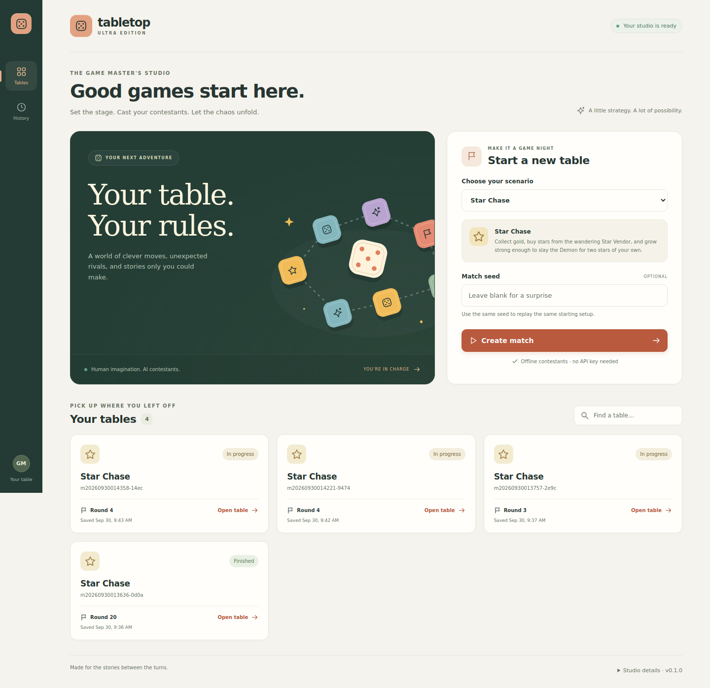
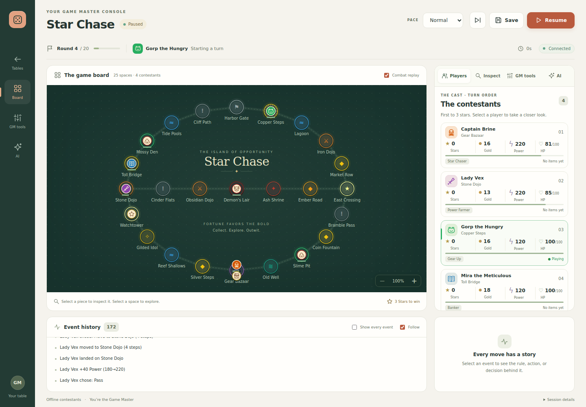

# TableTopGames-Ultra-edition

A customizable digital board-game sandbox. A human Game Master builds the board and rules, intervenes
live, and watches AI contestants compete, cooperate, negotiate and betray each other. Deterministic
engine code owns all game state, dice and combat; AI models only propose decisions.

- Architecture: [docs/ARCHITECTURE.md](docs/ARCHITECTURE.md)
- Milestone checklist: [docs/MILESTONES.md](docs/MILESTONES.md)

## Launch the studio

**Windows:** double-click **Start-TableTopGames.bat**. **Mac:** double-click **Start-TableTopGames.command**.

Install [Node.js LTS](https://nodejs.org/en/download) once if needed (22.18 or newer). The launcher
sets up dependencies and optional settings, then opens your browser automatically. No API key is
needed for offline play. Keep its window open; press **Ctrl+C** there to save and stop.

See [START-HERE.md](START-HERE.md) for setup, optional AI contestants and keeping saves when updating.
Terminal users can run `npm start`; use `npm start -- --no-browser` to leave the browser closed.

## Development

Requires Node.js 22.18 or newer (the server runs TypeScript sources directly).

```sh
npm install
cp .env.example .env      # optional: add OPENAI_API_KEY for model-driven contestants
npm run dev               # GM app at http://127.0.0.1:5173
npm run check             # typecheck (core, server, web) + tests
```

Without an API key everything still runs: contestants use the deterministic offline controller.
Set `TTG_CONTESTANT_PROVIDER=mock` to exercise the full model pipeline offline with a scripted
provider. Local saves, event histories and AI call logs are written to `data/` (git-ignored).

### Simulations

```sh
npm run sim -- --matches 200                 # balance report with the offline controller
npm run sim -- --seed demo --log             # one match, full event log
npm run sim -- --controllers mock            # one match through the model pipeline, offline
npm run sim -- --controllers llm             # one match with gpt-6-luna (needs OPENAI_API_KEY)
```

### Using the GM app

1. Create a match (Star Chase), press **Start match**. Contestants pick strategies, then play.
2. Click a token or player card to inspect it: stats (base vs. effective Power), items,
   personality, strategy, plan, and **View as contestant** (the exact packet its model sees).
3. **GM tools** act on the selected entity: adjust or set resources, add/remove tags, teleport
   (tick *counts as landing* to trigger landing rules), give items, announce. Tick *silent
   correction* to change state without triggering rules.
4. Fights play on the combat wheel, replaying the engine's recorded spins. Click any log line to
   see why it happened (rule, triggering event, conditions checked).
5. **Save** writes a snapshot; matches also autosave at every round end and on pause. After a
   restart, open the match from the list and resume — the state hash in the top bar matches.

### The tabletop studio

The studio uses warm ivory panels, a forest-green board, local SVG artwork and animated pieces.
The lobby includes searchable saved tables, and the live console puts player cards, match controls,
GM interventions and event explanations beside the board.

- Use **+ / −** on the board to zoom, scroll to explore, and click the percentage to reset.
- Select **GM tools** and choose an entity directly, or inspect a board piece first. Selecting a
  board space also sets the teleport destination.
- **Combat replay** controls the animated wheel; switching it off clears queued replays immediately.
- The event feed follows new events within its own panel. Selecting an event stops following so
  its explanation stays readable; re-enable **Follow** to catch up.
- Keyboard users can select spaces and pieces with **Enter** or **Space**. The interface honors
  reduced-motion preferences and adapts to smaller screens.
- Saves show a confirmation, controls wait for in-flight requests, and missing match links show
  an actionable error.
- Reading a snapshot or opening another viewer preserves pending live events for existing tabs.




Mobile previews: [lobby](docs/screenshots/lobby-mobile.png) · [match](docs/screenshots/match-mobile.png).
